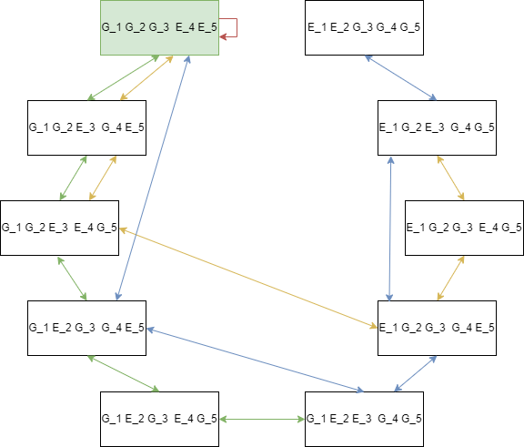

# Modelling Avalon

Authors: Anne-Jan Mein, Imme Huitema and Jelmer van Lune

## Description of Avalon

In the boardgame Avalon, two teams are playing against each other. These teams are: "Loyal servants of Arthur" (Good) and "Minions of Mordred" (Evil).  Team Good wins by completing three out of five quests, team Evil by making sure three out of five quests fail or by eliminating a special character called Merlin" after three quests have successfully been completed by team Good.

When playing with five players, the teams are split into three players on team Good (one of which is a special character called "Merlin") and two on team Evil (one of which is a special character called "Assassin"). At the start of the game everyone closes their eyes, and the players of team Evil reveal themselves to each other. Then everyone closes their eyes, and Merlin opens his eyes while the players of team Evil reveal themselves to Merlin without opening their eyes. This results in the players of team Evil knowing who is on team Good and who is on Team Evil without (most of) team Good knowing anything about other players than themselves. The only exception is Merlin, who also knows who is on team Good and Evil, but no one knows who Merlin is.

Every round a party leader is assigned. The first leader is random, the following leaders are chosen as right side neighbour of the previous leader. The leader can choose who goes on a quest. These players that were sent on a quest then have a choice to play a "Pass" or a "Fail" card. A quest is only completed if everyone that went on said quest played the Pass card, otherwise the quest fails. Players on team Good must always play a Pass card, while players on team Evil can choose. After the cards have been played it's visible to all players what cards have been played, but not which players on the quest team played what card. After a quest is completed a new party leader is assigned. The quest party size can vary depending on quest number, which is determined as follows: 

**Quest Number**  | **Quest Party Size**
-------------     | -------------
1                 | 2
2                 | 3
3                 | 2
4                 | 3
5                 | 3

Players must vote on the quest party compositions proposed by
the party leader. If the majority approves the quest party embarks on the quest, if five
quest party propositions are rejected in a row the quest is failed automatically and a
new round begins.
After three quests have been completed succesfully, team Evil gets one more chance
at victory. If they manage to determine who Merlin is, who might have revealed
himself by sharing his knowledge too blatantly, they can assassinate him and
win the game. 

Our implementation of this game is slightly simplified for practical purposes. The first simplification is that agents on team Good do not use the information provided by the voting of other players. Only members of team Evil will use this information to reason about the identity of Merlin. The second simplification is that agents will always according to their knowledge and reasoning. For example, agents of team Evil will never "randomly" lie to confuse players, which is something that happens often in the real game of Avalon. There also is no Evil agent that explicitly has the "Assassin" role, as with our implementation both Evil agents always have the same knowledge.

## Knowledge and reasoning in our implementation of Avalon

- **Initial Knowledge**  
  The logic in this game uses two propositional atoms: *e i * and *m i *. *e i * entails:
  Agent *i* is Evil. *m i * entails agent *i* is Merlin

  Consider a game where agents 1 and 2 are Good, agent 3 and 4 are Evil
  and agent 5 is Merlin. The initial knowledge of each agent is given by:

  - **Team Good**  
    An agent on team Good knows that they are not Evil themselves.
    *K 1 * ¬*e 1 * ∧ K 2  ¬*e 2 *

  - **Team Evil**  
    An agent on team Evil knows for every agent whether they are Good
    or Evil, and considers it possible that any agent on team Good is
    Merlin.  
    *K 3 * (*e 3 * ∧ *e 4 * ∧ ¬*e 1 * ∧ ¬*e 2 * ∧ ¬*e 5 * ∧ (*m 1 * ∨ *m 2 * ∨ *m 5 *)) ∧  
    *K 4 * (*e 4 * ∧ *e 3 * ∧ ¬*e 1 * ∧ ¬*e 2 * ∧ ¬*e 5 * ∧ (*m 1 * ∨ *m 2 * ∨ *m 5 *)) ∧  
    *K 3 * (*K 1 * ¬*e 1 * ∧ K 2  ¬*e 2 *  ∧ *K 5 * ¬*e 5 *) ∧  
    *K 4 * (*K 1 * ¬*e 1 * ∧ K 2  ¬*e 2 *  ∧ *K 5 * ¬*e 5 *) ∧  
    *K 3 * *K 4 * (*K 1 * ¬*e 1 * ∧ K 2  ¬*e 2 *  ∧ *K 5 * ¬*e 5 *) ∧  
    *K 4 * *K 3 * (*K 1 * ¬*e 1 * ∧ K 2  ¬*e 2 *  ∧ *K 5 * ¬*e 5 *)
    etc..

    Anything known to one evil agent is also known to the other:  
    *K 3 * φ → *K 4 * φ  
    *K 4 * φ → *K 3 * φ  
    
    They also know that the other evil agent knows the same as they do:  
    *K 3 * φ → *K 3 * *K 4 * φ  
    *K 4 * φ → *K 4 * *K 3 * φ  

  - **Merlin**  
    Merlin knows for every agent whether they are Good or Evil  
    *K 5 * (¬*e 1 * ∧ ¬*e 2 * ∧ *e 3 * ∧ *e 4 * ∧ ¬*e 5 *) ∧ 
    *K 5 * (*K 3 * (*e 3 * ∧ *e 4 * ∧ ¬*e 1 * ∧ ¬*e 2 * ∧ ¬*e 5 * ∧ (*m 1 * ∨ *m 2 * ∨ *m 5 *))) ∧  
    *K 5 * (*K 4 * (*e 4 * ∧ *e 3 * ∧ ¬*e 1 * ∧ ¬*e 2 * ∧ ¬*e 5 * ∧ (*m 1 * ∨ *m 2 * ∨ *m 5 *))) ∧  
    *K 5 * (*K 3 * (*K 1 * ¬*e 1 * ∧ K 2  ¬*e 2 *  ∧ *K 5 * ¬*e 5 *)) ∧  
    *K 5 * (*K 4 * (*K 1 * ¬*e 1 * ∧ K 2  ¬*e 2 *  ∧ *K 5 * ¬*e 5 *)) ∧  
    *K 5 * (*K 3 * *K 4 * (*K 1 * ¬*e 1 * ∧ K 2  ¬*e 2 *  ∧ *K 5 * ¬*e 5 *)) ∧  
    *K 5 * (*K 4 * *K 3 * (*K 1 * ¬*e 1 * ∧ K 2  ¬*e 2 *  ∧ *K 5 * ¬*e 5 *))
    

  In order to lower the complexity of our simulation, only the Evil players use their knowledge
  about who Merlin possibly is. Merlin simply acts like any other Good player, except he
  starts the game with full knowledge about other agents roles (similar to an Evil player). 

- **Determine Party Leader**  
  At the beginning of the game a random order is created which determines
  who will be the party leader. The first party leader will be the first person
  in this list, the next party leader the one after etc. etc.

- **Choose Quest Party**  
  The party selection for the quest is determined by the party leader. The
  choice of the party leader depends on whether the party leader is a member
  of team Good, team Evil or Merlin.
  - **Team Good**  
    When the party leader belongs to team Good they will start of filling up the 
    quest party with members of which they know that they belong to team Good.
    They will then try to fill up the rest of party with agents about whom
    they do not know whether or not they are Evil.

  - **Team Evil**  
    When the party leader belongs to team Evil they do not want to send
    a member of team Evil on the quest that has been revealed as Evil to
    any of the team Good members, because these team Good members
    will then vote against the quest party. In other words, if the party leader
    knows that any of the team Good members knows the identity of
    one of the members of team Evil, they will not choose that team
    Evil member to go on the quest. If this happens the party leader will
    choose the other member of team Evil that has not yet been revealed.
    The party leader will ignore the fact one player always knows both identities
    due to the existance of Merlin.
    The remaining spots for the quest are then randomly chosen from the
    Good members. The party leader will always choose one Evil member
    for the quest, even if both Evil members have been revealed to the
    Good members. This Evil member will then be chosen randomly.
    This is done because the Evil members do not want to send a party
    that consists of only Good members.

    In short, a party leader from team Evil will choose the Evil agent
    whose identity is known to the least amount of Good agents.

  - **Merlin**  
    When the party leader is Merlin it behaves the same as a team
    Good member. Because Merlin knows the identity of all agents, Merlin will only choose players randomly out of the group of team Good
    to send on a quest.

- **Voting on Quest Party**  
  When a party is proposed by the party leader, each agent in the game
  votes whether they want that chosen party to go on the quest or not. How
  each agent votes depends on whether they belong to team Good, team
  Evil or Merlin.

  - **Team Good**  
    A member of team Good will always disagree if they know that a
    member of team Evil is on the quest party. Otherwise they will agree
    with the proposed quest party.

  - **Team Evil**  
    Members of team Evil want to ensure that at least one evil agent is part of any quest party, so they will
    always agree if one member of team Evil is in the proposed quest
    party. Otherwise they will disagree with the proposed quest party. If the quest party consists of only Evil agents (this can only happen in rounds 1 and 3), they       will vote against it as it would force them to either not sabotage (which costs them a round), or reveal their identities.

  - **Merlin**  
    Merlin will use the same logic as a regular member of team Good,
    but can, depending on the version of Merlin used, choose to vote against
    his knowledge and reasoning.
    This means that
    Merlin will agree with a party proposition that consists of a member
    of team Evil. This is done as an attempt to stay hidden, giving the
    members of team Evil no information about his own knowledge.

- **Pass or Fail Quest**  
  Whether an agents chooses a pass or fail card when sent on a quest depends
  on whether the agents belongs to team Good or team Evil.
  - **Team Good**  
    A member of team Good will always play the pass card when embarked
    on the quest.

  - **Team Evil**  
    A team Evil member will want to play a fail card to fail the quest.
    However, a member of team Evil will take into consideration that
    playing a fail card can result in the identity of both Evil members
    being discovered by a team Good member. If this can happen, they
    will choose a pass card instead of using a fail card, to hide the identities of team Evil.
    The exception to this is if the Evil team only need 1 more failed quest to win. In this case there is no downside to sabotaging the quest as the game will
    end afterwards, they will play a fail card regardless of what the resulting increase in knowledge for any good agent might be.
    
  - **Merlin**  
    For Merlin the behavior is the same as team Good. This means
    Merlin will always play the pass card when chosen on the quest.

- **Updating Knowledge Based On Public Announcements And Reasoning**  
  The general voting of individual agents on party makeup is not considered
  a public announcement in our model. This is done in order to simplify the
  workings of our implementation.  

  The proposed quest party of the party leader is also not considered a public
  announcement about the knowledge of the party leader in our model.
  These restrictions are chosen to simplify the workings of our implementation.  
  - **Team Good**  
    The knowledge of members of team Good will be updated based on
    a public announcement that is a result of the quest passing/failing.
    If, for example, agent 1 and 2 are sent on a quest which fails with
    one fail card. This results in the following public announcement for
    everyone: [*e 1  ∨ e  2 *].  

    If agent 1 is on team Good, *K*  1  ¬*e*  1  therefore after this public announcement *K*  1  *e*  2 . 
    If a quest fails with all fail cards then the following announcement will be made:    
    [*e 1  ∧ e  2 *].  
    The same logic can be applied for quest were the quest party consists of three agents.
    
  - **Team Evil**  
    The knowledge of team Evil is reasoned based on the voting of team Good members 
    on quest party propositions. If an agent votes on a
    quest party that consists of at least one member of team Evil, then
    the members of team Evil will not consider that agent to be Merlin
    anymore. Furthermore, when a member of team Good was chosen to
    go on a quest together with a member of team Evil, and that Evil
    played the fail card, both team Evil members now know that the
    Good member knows that the Evil member that went on the quest
    is Evil.

  - **Merlin**  
    Merlins knowledge is not updated, as this agent already knows
    everyone’s role/allegiance.

- **If team Good won**
  If team Good won the game, members of team Evil will look at who they believe Merlin is. If they know the identity of Merlin they will choose to     
  assassinate Merlin, resulting in a victory for team Evil. If they are unsure, the agent will randomly choose one of the players that they are uncertain about.

## Example Run

This section covers an example run of a game of Avalon to show how knowledge
of the different agents changes as the game progresses, and how this influences
their decisions while playing.  

### Initial Knowledge

Consider a game where agents 1 and 2 are Good, agent 3 and 4 are Evil and
agent 5 is Merlin. The initial knowledge of each agent is given by:  

*K*  1  ¬ *e*  1   
*K*  2  ¬ *e*  2   
*K 3 * (*e 3 * ∧ *e 4 * ∧ ¬*e 1 * ∧ ¬*e 2 * ∧ ¬*e 5 * ∧ (*m 1 * ∨ *m 2 * ∨ *m 5 *)  
*K 4 * (*e 4 * ∧ *e 3 * ∧ ¬*e 1 * ∧ ¬*e 2 * ∧ ¬*e 5 * ∧ (*m 1 * ∨ *m 2 * ∨ *m 5 *)) ∧  
*K 4 * (*e 4 * ∧ *e 3 * ∧ ¬*e 1 * ∧ ¬*e 2 * ∧ ¬*e 5 * ∧ (*m 1 * ∨ *m 2 * ∨ *m 5 *) ∧  
*K 3 * (*e 3 * ∧ *e 4 * ∧ ¬*e 1 * ∧ ¬*e 2 * ∧ ¬*e 5 * ∧ (*m 1 * ∨ *m 2 * ∨ *m 5 *))  
Melin's knowledge is the same as the evil players knowledge, except he knows who Merlin is.

### Quest 1

- **party leader is assigned and proposes party**  
  Then the first party leader is randomly chosen and agent 1 becomes mission
  leader. Agent 1 is an agent of team Good, and will therefore try to propose a
  party consisting of other members of team Good. The only agent i for which
  *K*  2  ¬ *e*  i   is agent 1 itself. To fill the second spot in the party, agent 1 will try
  to avoid choosing any Evil players, but agent 1 has no knowledge about other
  agents alliance yet, so it will randomly select agent 4, and proposes the first
  party consisting of agent 1 and agent 4.

- **Voting on quest party**  
  Now, each agent can vote for or against this party to go on the quest. Agent 1
  automatically votes in favor, as they proposed this team. Agent 2 is not aware
  of any Evil players being on this party, because *K*  2  ¬ *e*  2 , and therefore will also
  vote in favor. Agent 3 knows that *K*  3 ( ¬ *e*  1  ∧ *e*  4  ) and therefore votes in favor of
  this party. Agent 4 idem. Agent 5 knows *K*  5 ( ¬ *e*  1  ∧ *e*  4  )and will vote against
  this party (because they know there is an Evil player in the party).  
  This results in 4 votes in favor and 1 vote against, so agents 1 and 4 go on
  the first quest.

- **Questing agents pass/fail**  
  Agent 1 is a Good agent, and will therefore play a pass card for the quest. Agent
  4 is an Evil agent, and agent 4 knows that it will only reveal its own identity to
  agent 1 if they sabotage and, so they are fine with sabotaging this quest. (We
  intentionally don’t write down the knowledge of agent 4 about the knowledge
  of the 3 Good agents in order to make this section easier to read).  

  Then, the quest fails because at least one of the two agents played a fail
  card, awarding one point to team Evil.

- **Knowledge update based on outcome**  
  The outcome of the quest is a public announcement in the form of [e1 ∨ e4]. The
  following changes about each agents’ knowledge: [*e 1  ∨ e  4 *].  

  Agent 1 now knows that agent 4 is Evil: *K*  1  (¬ *e*  1  ∧ *e*  4 )  
  Agent 2 now knows that agent 1 or 4 is Evil: *K*  2  (¬ *e*  2  ∧ (*e 1  ∨ e  4 *))  
  Agent 3 now knows that agent 1 knows that agent 4 is Evil: *K*  3  *K*  1  *e*  4   
  Agent 3 also no longer considers it possible that agents 1 and 2 are not Merlin,
  because they voted in favor of a quest containing an Evil agent: *K*  3  *m*  5   
  Agent 4 now knows that agent 1 knows that agent 4 is Evil *K*  4  *K*  1  *e*  4   
  Agent 4 also no longer considers it possible that agents 1 and 2 are not Merlin,
  because they voted in favor of a quest containing an Evil agent: *K*  4  *m*  5   
  Note that we omit some of the previous knowledge of some agents in order to
  keep this section readable and short.

### Quest 2
- **party leader is assigned and proposes party**  
  Agent 2 becomes the second party leader. They have no certain knowledge about
  any agents identity other than their own, and therefore will select themselves
  and a random agent for this mission. They propose the second party to consist
  of agent 2, 3 and 4.

- **Voting on quest party**  
  Agent 1 votes against this party, because they know that agent 4 is Evil *K*  1  *e*  4   
  Agent 2 votes in favor  
  Agent 3 votes in favor, as they know that agent 4 is Evil.  
  Agent 4 votes in favor, as they know that they themselves are Evil.  
  Agent 5 votes against this party, because they know that agent 4 is Evil *K*  5  *e*  4   

  This results in 3 votes in favor and 1 vote against, so agents 2, 3 and 4 go
  on the second quest.

- **Questing agents pass/fail**  
  Agent 2 is a Good agent, and will therefore play a pass card for the quest.
  Agents 3 and 4 know that if they both play a fail card, their identities get
  revealed to agent 2, so in order to ensure that agent 2 does not discover both
  their identities, they both play a fail card (this is necessary because they can
  not communicate to each other to make one of them play a fail while the other
  passes).  
  Consequentially, the quest succeeds, and team Good gets 1 point.

- **Knowledge update based on outcome**  
  Because no fail cards were revealed for this quest, none of the agents learn
  anything.

## Research Question and Experiments
Initially we wanted to investigate the influence of Merlin on the winrate of team Good in the game of Avalon. Multiple games would be played between the two teams with different implementations of Merlin. The first would be no Merlin on team Good, only regular agents. The second would be a 'naive Merlin', that would always vote according to his knowledge and reasoning. The final version would be 'cautious Merlin'. This Merlin would use higher order knowledge in order to determine if he would vote according to his knowledge and reasoning or not. He would examine if, when he would vote according to his knowledge and reasoning, he would be revealed to team Evil as Merlin. If this was the case he would vote against his knowledge and reasoning, otherwise he would follow it.
The example run discussed earlier was based on a naive Merlin and with Evil agents that use higher order knowledge.  

However, when working on the implementation we encountered an issue with mlsolver. mlsolver trys to generate all the possible subsets of the worlds in our model. This resulted in $2^30$ subsets being considered, as there are 30 possible worlds with 5 players. This resulted in the RAM on our computer (16 GB) filling up and crashing the computer. It was concluded that our implementation of Avalon could not be run/created on a consumer computer, thus we decided to further simplify our implementation.

We decided to still investigate Merlin, but an extremely simplified version. We removed everything related to the m operator in our model. This results in only the e operator remaining, and thus only knowledge about if an agent belongs to team Evil or not. This decreases the number of worlds to 10, making it possible to model on a consumer tier computer. We decided to implement this 'simplified Merlin' by taking one of the members of team Good, and giving him knowledge about everyone's role. This is the same as regular Merlin, but without the m operator, agents of team Evil cannot reason about the identity of Merlin. To partially compensate for this, we decided to add a parameter that, after team Good has won a game where Merlin was present, team Evil will randomly assassinate a member of team Good. This means that, after team Good won, team Evil has a 33\% chance of winning anyway. Finally we also decided to look at these parameters in games where team Evil uses higher order knowledge and where they do not.
Whether Evil agents can use higher order knowledge or not is also something we want to examine. If they use higher order knowledge they will reason about playing a pass or fail card when on a quest. If they reveal themselves when playing a fail card they will then play a pass card instead. If they do not use higher order knowledge then they will always play a fail card when on a quest.

These implementations result in the following parameters: 
- Number of games: This is set to 1000 in order to get a good idea of the average results for each parameter configuration
- Merlin: Determines if Merlin is added to the game, can be set to True or False.
- Higher Order Evil: Determines if team Evil uses higher order knowledge or not, can be set to True or False.
- Evil Can Assassinate: Determines if, after a victory of team Good, a random agent of team Good is assassinated. If Merlin was assassinated then team Evil wins, can be set to True or False.

Our research question is therefore: How does the inclusion of an all-knowing Merlin in team Good, and the ability of Evil agents to reason about other agents knowledge affect winrates of both teams in the game of Avalon.

The results that were gathered are the winrates of both team Good and team Evil, the average round length, the average round length if team Good won and the average round length if team Evil won.  

The following image shows the initial knowledge of 5 agents in a run without Merlin. The world highlighted in green is the true world, wherein agents 1, 2 and 3 are Good and agents 4 and 5 are Evil. The arrows indicate what world each agent considers possible. The green arrow connects all worlds considered possible by agent 1, which are all the worlds in which agent 1 is Good. The yellow arrow does the same for agent 2, and the blue for agent 3. Both agents 4 and 5 consider only the true world possible, as they know everyone's identity, this is indicated by the red arrow. It is important to note that these arrows are transitive, meaning that if world A and B are connected by a green arrow and B and C are connected by a green arrow, there is also an implied (but not shown) arrow between A and C. This is done in order to keep the picture more readable.  

  

If we were to give agent 3 the Merlin role, all blue arrows as they are drawn right now would be removed, and a single blue arrow connecting the "true" world to itself would be added, as agent 3 now also knows everyone's identity.  

### Implementation
We will implement a Kripke model to simulate AI players against other AI players. This will be implemented using the Python programming language, using the mlsolver framework for implementing the Kripke model and modelling the behaviour of the agents. Mlsolver is a framework for creating Kripke structures and solving modal logical formulas.  

### Results
The following table show the results of all the different parameter configurations that were examined:

| **Merlin** | **Higher Order Evil** | **Evil Can Assassinate** | **Good Winrate** | **Evil Winrate** | **Average Round Length** | **Round Length Good Won** | **Round Length Evil Won** |
|------------|-----------------------|--------------------------|------------------|------------------|--------------------------|---------------------------|---------------------------|
| _False_    | _False_               | _False_                  | 46%              | 54%              | 3.765                    | 4.26                      | 3.34                      |
| _True_     | _False_               | _False_                  | 69%              | 31%              | 3.975                    | 4.17                      | 3.53                      |
| _False_    | _True_                | _False_                  | 5%               | 95%              | 3.865                    | 4.35                      | 3.84                      |
| _True_     | _True_                | _False_                  | 13%              | 87%              | 4.18                     | 4.39                      | 4.15                      |
| _True_     | _False_               | _True_                   | 50%              | 50%              | 3.985                    | 4.12                      | 3.81                      |
| _True_     | _True_                | _True_                   | 10%              | 90%              | 4.198                    | 4.3                       | 4.19                      |

When no higher order knowledge is used by the Evil agents and no Merlin is in the game, the winrate of both teams is almost even. Team Evil has a slightly higher winrate than team Good, with 54% and 46% respectively. Adding Merlin, while team Evil has no higher order knowledge, drastically increases the winrate of team Good to 69%. If Merlin can be assassinated in this setup, the winrate evens out to 50%/50%. When agents on team Evil can use higher order knowledge, the winrate for team Evil increases immensely. When there is no Merlin, the winrate of team Evil is 95%. If Merlin is added the winrate decreases slightly to 87\%. If team Evil can assassinate their winrate slightly climbs back up to 90%.  

The average round lengths do not vary much between different parameters. It is, however, noteworthy that team Evil wins the fastest when all parameters are set to False. Furthermore, games where team Evil wins are consistently faster (less average rounds per game) than games where team Good wins.

## Conclusion
The results show that, when all parameters are turned to False, team Evil has a slightly higher win rate. Including Merlin on team Good always has a positive impact on the win rate of team Good.  This is expected, as in a game of knowledge, a player who knows everything at the start of the game is extremely valuable. However, if team Evil can assassinate, the influence of Merlin diminishes. In this situation team Good does still have a slightly higher win rate compared to no Merlin on team Good. We expect that when Evil agents can reason about the identity of Merlin (as we originally wanted to implement), the influence of Merlin will diminish further, because the Evil agents are more likely to know who Merlin is. However, if there was a cautious Merlin that would try to hide its identity, the influence of Merlin on the win rate for team Good would possibly increase again.  

If the agents on team Evil can use higher order reasoning their win rate increases drastically. This is in line with our expectations, as the members of team Evil are now very careful about their actions. This results in members of team Good almost never being certain about who is a member of team Evil.  

We believe the large advantage for team Evil (when they use higher order knowledge reasoning) is because Good agents do not have a reliable way to learn more about the identity of other players other than going on a quest with a single other agent. In a real game, Good agents also look at how other agents vote and what teams they propose in order to learn more about other agents identities. This was not included in our implementation and can be looked into for future research.   

Furthermore. further research could also look into further working out our original implementation of the game of Avalon with Merlin included where Evil agents can reason about his identity. This would then have to be run on a relatively powerful computer.
